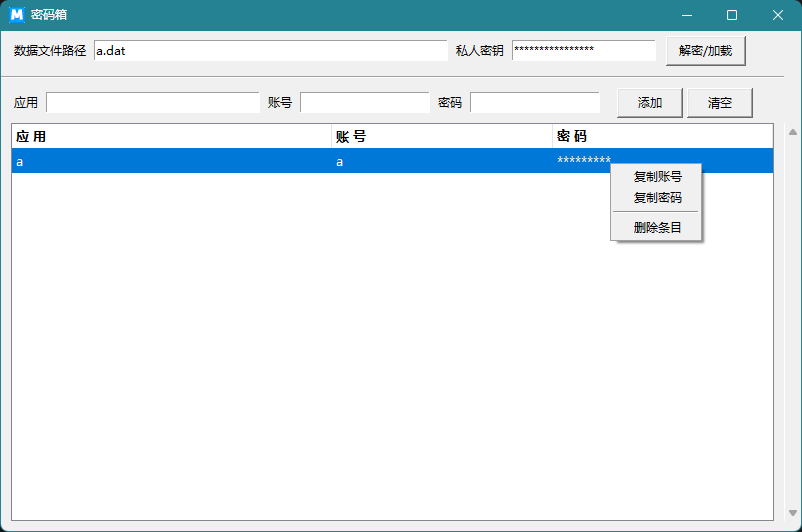

# MMBox 密码箱工具开发文档

## 一、项目简介

MMBox是一个私人密码管理工具，旨在帮助用户管理多个应用账号和密码。用户只需记忆一个主密码，即可安全存储和访问所有其他账号密码信息。



项目结构：
- mmbox
   - .gitignore git忽略项
   - a.dat      数据文件（测试用）
   - app.png    应用界面截图，说明文档中使用，与程序无关
   - mm.ico     应用程序图标（打包windows程序时使用）
   - mmbox.py   主要程序文件
   - README.md  说明文档

## 二、功能 & 使用

### 主要功能

1. **数据文件路径**
   - 用户可以输入电脑任一位置的文件路径（加密存储账号密码信息，文件使用文本类型即可，后缀自定义可以更有迷惑性）。

2. **私人密钥 & 解密数据 & 加载数据**
   - 私人密钥目前设定为16位，如有必要，可自行修改代码中的 `get_cipher` 方法，由于使用 AES 加密，密码长度需为16/24/32字节。
   - 点击“解密/加载”按钮，可以解密并加载文件数据；此过程数据在内存中并没有持久化，且数据文件依然是密文，不用担心数据泄漏。

3. **添加新数据**
   - 可以输入新的应用、账号、密码数据，点击“添加”按钮，新增数据；“清除”按钮可以一键清空账号密码数据。
   - 如果账号已存在，会提示是否覆盖旧密码。

4. **表格数据操作**
   - 表格中数据选一行，可以右键选择菜单项，进行复制账号、密码，或者删除数据。
   - 双击表格中的选中行，可以进行密码的显示隐藏。

### 加密机制
- 使用的是 AES 加密算法，CBC 模式（Cipher Block Chaining）。
- 数据是整个文件内容加密的。

### 使用建议
- 应用程序建议存放于网盘，随时随地下载使用。
- 数据文件可以放到任意位置（建议网盘，随时随地进行下载使用及更新）。
- 私钥怕忘记可以写入一个自己喜欢的文件，放入电脑自己喜欢的位置独立存放，不要与以上二者共存，**强烈建议依靠记忆**。

## 三、打包部署

1. 本项目使用 Python 3，请先适配对应开发环境，建议版本 3.10 及以上。
2. 安装第三方模块：
    ```shell
    # 用于程序执行
    pip install pycryptodome
    # 用于程序打包
    pip install pyinstaller
    ```
3. 选择自己喜欢的应用图标文件，放入项目根目录（不同操作系统文件类型不同）。
4. 执行打包命令，在项目根目录下，会出现 `dist` 目录，可以找到 exe 应用程序：
    ```shell
    # Windows环境（验证可行）
    pyinstaller --onefile --windowed --icon=mm.ico mmbox.py
    # Ubuntu（Linux）环境（仅提示，未验证）
    pyinstaller --onefile --noconsole --add-data "path/to/icon.png:." --icon=path/to/icon.png mmbox.py
    # macOS环境（仅提示，未验证）
    pyinstaller --onefile --windowed --icon=mm.icns mmbox.py
    ```
## 四、常见问题
**1. 忘记私人密钥怎么办？**
> 私人密钥是解密数据的唯一凭证，无法找回。建议使用记忆点突出密码或将其存储在安全的物理位置。

**2. 数据文件损坏如何处理？**
> 数据文件损坏无法恢复。建议创建备份文件，如遇损坏可尝试恢复备份。

**3. 如何确保程序本身是安全的？**
> 代码已开源，欢迎审查。建议下载代码编译打包执行程序文件。